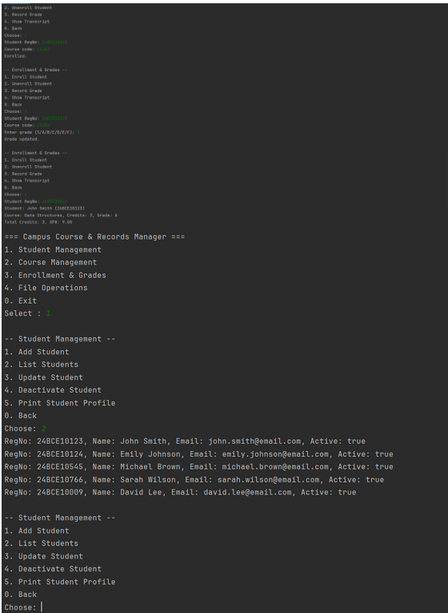
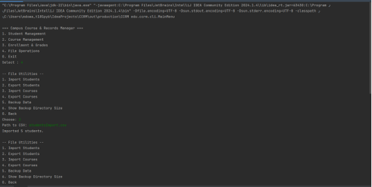
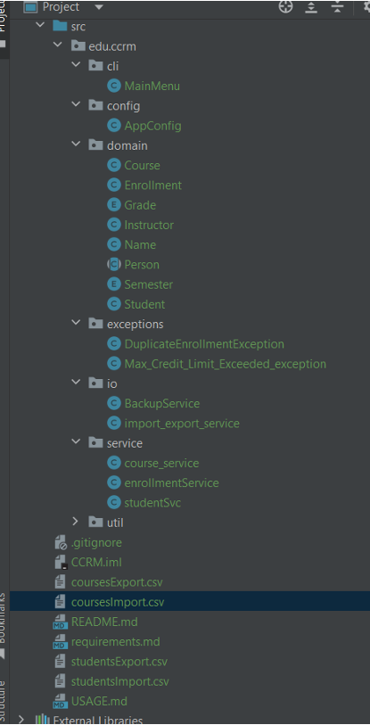

# 👋 Welcome to Campus Course & Records Manager (CCRM)!

## What is CCRM?

**CCRM** is your all-in-one, easy-to-use command-line app for managing academic records at any institute. Whether you’re a student, instructor, or admin, CCRM helps you keep track of students, courses, enrollments, grades, and more—all from a simple terminal interface.

### What can you do with CCRM?
- **Manage Students:** Add, list, update, deactivate, enroll, and unenroll students in courses.
- **Manage Courses:** Add, list, update, deactivate, search/filter, and assign instructors.
- **Grades & Transcripts:** Record grades, calculate GPA, and print transcripts.
- **File Utilities:** Import/export data as CSV, create backups, and use handy recursive utilities.

CCRM is built with modern Java (OOP, exception handling, NIO.2, Date/Time API, streams, lambdas) and classic CLI programming for a robust, real-world experience.


---

## 🚀 Quick Start

### 1. Prerequisites
- **Java 17 or newer** (get it from [AdoptOpenJDK](https://adoptium.net/))
- Any Java IDE (IntelliJ IDEA, Eclipse, or just your favorite terminal!)

### 2. Clone & Set Up
1. Download or clone this repository.
2. Open your terminal in the project root.
3. Compile all Java files:
  ```powershell
  javac -d out src/edu/ccrm/cli/*.java src/edu/ccrm/config/*.java src/edu/ccrm/domain/*.java src/edu/ccrm/exceptions/*.java src/edu/ccrm/io/*.java src/edu/ccrm/service/*.java src/edu/ccrm/util/*.java
  ```
4. Run the app:
  ```powershell
  java -cp out edu.ccrm.cli.MainMenu
  ```

Or, open the project in your IDE and run the `MainMenu` class directly.

---

## 🗂️ Project Structure

```
CCRM/
├── src/
│   └── edu/ccrm/
│       ├── cli/
│       ├── domain/
│       ├── service/
│       ├── io/
│       ├── util/
│       └── config/
├── students.csv
├── courses.csv
├── README.md
├── USAGE.md
└── requirements.md
```

---


## ✨ Features at a Glance


- **AppConfig (Singleton):** Loads configuration at startup
- **Main menu:** Students, Courses, Enrollment & Grades, File Operations, Backup, Reports, Exit
- **User-friendly navigation:** All operations use clear menus and prompts
- **Reports:** Print transcripts, see top students, GPA distribution (using Java streams)
- **File import/export & backup:** CSV import/export, backup with NIO.2


---

## 📄 Sample CSV Formats

**students.csv**
```csv
regNo,fullName,email
2025001,John Smith,john.smith@email.com
2025002,Emily Johnson,emily.johnson@email.com
```

**courses.csv**
```csv
code,title,credits,semester,department
CS101,Introduction to Programming,3,FALL,Computer Science
```


---

## 🛠️ Under the Hood: What You'll Learn

- **Packages & Structure:** Explore clean, modular Java code in `src/edu/ccrm/...`
- **OOP in Action:** Encapsulation, inheritance, abstraction, and polymorphism in real-world scenarios
- **Abstract Classes & Interfaces:** See `Person` (abstract), custom interfaces for searching/filtering
- **Enums:** For `Semester`, `Grade`, and more
- **Builder & Singleton Patterns:** Used in `Course` and `AppConfig`
- **Lambdas & Streams:** Modern Java for sorting/filtering
- **Custom Exceptions:** Robust error handling
- **Assertions:** For code safety (enable with `-ea`)
- **NIO.2, Date/Time API, Recursion:** For file ops and utilities


---

## 📚 Syllabus Mapping: Where to Find What

| Syllabus Topic                  | File/Class/Method                  |
|---------------------------------|------------------------------------|
| Primitive/Operators/Decisions   | MainMenu.java, service classes     |
| Loops/Jumps                     | MainMenu.java                      |
| Arrays & Utilities              | StudentService, CourseService      |
| String Manipulation             | ImportExportService                |
| Encapsulation/Inheritance       | Person, Student, Instructor        |
| Abstraction/Polymorphism        | Person, Transcript                 |
| Interfaces & Lambdas            | service, util                      |
| Exception Handling/Custom Excep.| exceptions/, EnrollmentService     |
| Patterns (Singleton/Builder)    | config/AppConfig, Course.java      |
| Streams & NIO, Date/Time        | io/ImportExportService, util       |
| Recursion                       | util/RecursionUtils                |


---

## 🛡️ Enabling Assertions (for Developers)

Want to see extra safety checks? Run with assertions enabled:
```powershell
java -ea -cp out edu.ccrm.cli.MainMenu
```
You’ll find assertion checks in various service/domain/utility classes.


---

## 🖼️ Screenshots

Here’s what CCRM looks like in action:






---

## 🤝 Academic Integrity

This project is individual work and follows VIT’s honor code. All logic, documentation, and code are original unless otherwise cited. See “Acknowledgements” for any references.


---

## 📬 Contact

**Author:** MOHD OWAIS  
**Email:** md.owais111234@gmail.com  
**Institution:** VIT BHOPAL